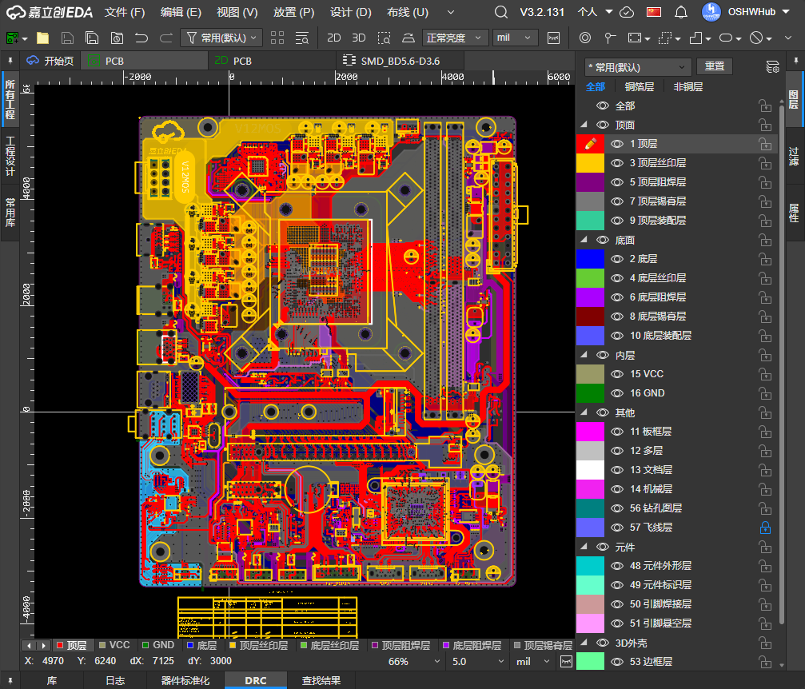
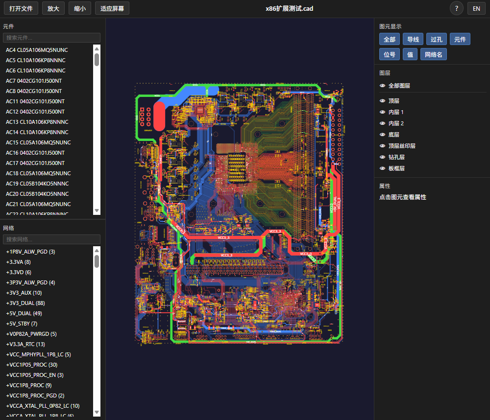

[简体中文](#) | [English](./README.en.md)

# Export GenCAD

嘉立创EDA (EasyEDA) 专业版扩展 — 将 PCB 设计导出为 GenCAD (.cad) 文件格式，用于 PCB 制造和测试数据交换。

| PCB画布 | GenCAD预览 |
| --- | --- |
|   |   |

## 功能

- 导出 PCB 为 GenCAD 1.4 标准格式
- 解析封装源数据（elibz2/elibu 格式），获取精确的焊盘几何和丝印轮廓
- 支持原生 GenCAD CIRCLE 和 ARC 命令（非线段近似）
- 正确处理焊盘旋转角度
- 输出 TEXT（位号/值），保留 PCB 中的原始属性：坐标、旋转、镜像、字号
- 缓存封装数据，避免重复解析
- 导出板框轮廓（支持 Polyline、Fill、Line 多种来源）
- 导出焊盘堆叠定义，自动去重
- 导出器件、引脚、网络、走线、过孔等完整信息
- 坐标自动转换：EasyEDA 内部单位 (mil) → 英寸 (inch)

## 使用方法

1. 在嘉立创EDA专业版中打开一个 PCB 文档
2. 点击 PCB 菜单栏 **Export GenCAD → Export GenCAD (.cad)...**
3. 自动生成并下载 `.cad` 文件
4. 导出的 `.cad` 文件可以使用[在线GernCAD查看器](https://pcbtool.net/tools/online-gencad-viewer.html)进行预览

## 开源许可

[Apache License 2.0](https://choosealicense.com/licenses/apache-2.0/)
